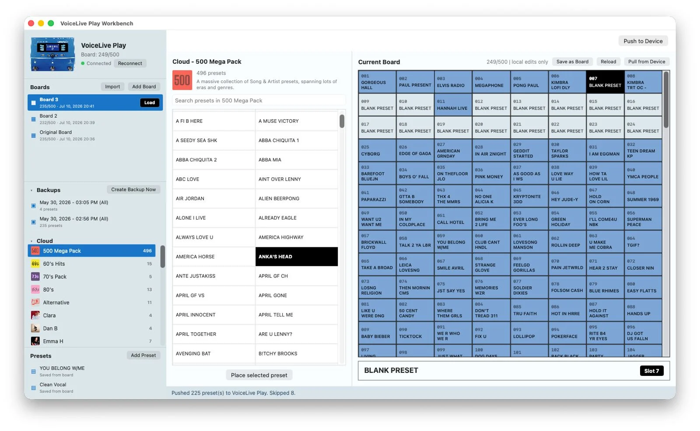
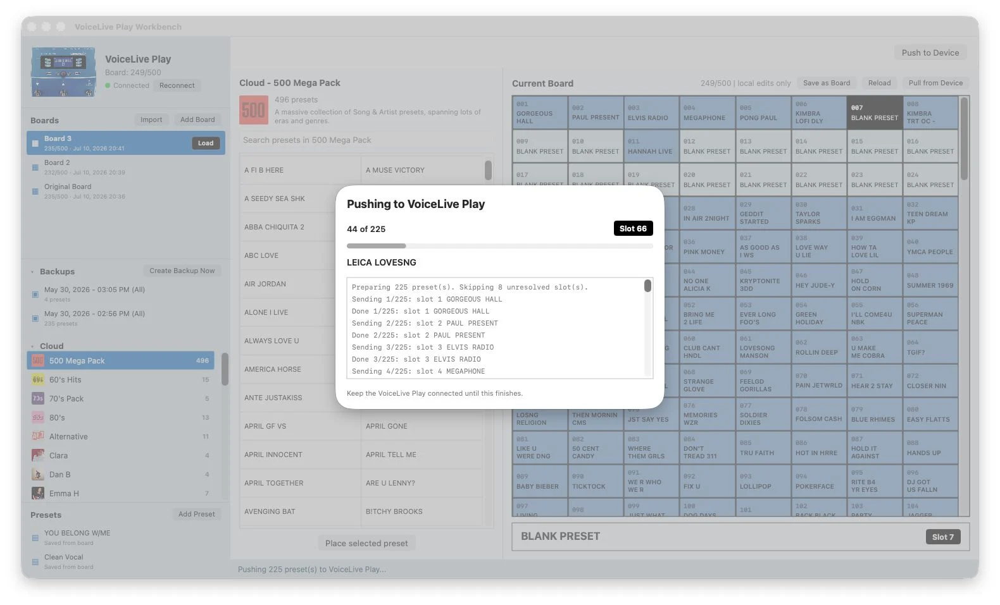

  

<h1 align="center">VoiceLive Play Workbench</h1>

  A native macOS workbench for managing TC-Helicon VoiceLive Play boards, backups, cloud preset packs, custom presets, and device transfer workflows.

  
  
  

  <a href="#what-it-does"><strong>What It Does</strong></a> ·
  <a href="#screenshots"><strong>Screenshots</strong></a> ·
  <a href="#launch"><strong>Launch</strong></a> ·
  <a href="#project-layout"><strong>Project Layout</strong></a>

---

## What It Does

| Area | Purpose |
|---|---|
| **Boards** | Build and manage full VoiceLive Play slot layouts without overwriting the hardware while you experiment. |
| **Backups** | Load saved VoiceSupport backups and use them as board sources or recovery references. |
| **Cloud packs** | Browse imported preset packs with names, artwork, preset counts, and individual preset lists. |
| **Custom presets** | Create reusable presets and place them into boards. |
| **Effect builder** | Edit presets through musician-facing controls instead of raw device data. |
| **Device workflow** | Detect the connected VoiceLive Play and keep transfer actions explicit and visible. |

## Screenshots

### Board Editor

  

### Device Transfer

  

---

## Launch

| Method | Action |
|---|---|
| **Finder** | Double-click `VoiceLive Play Workbench.app` |
| **Terminal** | Run `./VoiceLive\ Play\ Workbench.command` |

## Project Layout

| Path | Purpose |
|---|---|
| `NativeApp/` | SwiftUI application source. |
| `VoiceLive Play Workbench.app/` | Built macOS app bundle. |
| `assets/readme/` | README screenshots. |
| `captures/` | MIDI, SysEx, screen, and filesystem captures. |
| `data/voiceSupportCatalog.json` | Local preset pack catalog used by the app. |
| `samples/` | Small test fixtures. |
| `boards.json` | Local board data. |
| `custom-presets.json` | Local custom preset data. |
| `workspace-state.json` | Current workspace state. |

## Device Safety

The app separates local board editing from hardware writes. Build, edit, import, export, and compare locally first; push to the VoiceLive Play only when the transfer path is clear and recoverable.
